# RECONGRAPH

### FINANCIAL RECONCILIATION INTELLIGENCE

# RECONSTRUCT EVERY RUPEE.

Trace payments, settlements, refunds and adjustments through one evidence-backed financial graph.

[Architecture](#system-architecture) • [Benchmark](#measured-not-claimed) • [Quick Start](#run-recongraph)


ReconGraph reconstructs the financial journey behind a settlement, connecting payments, settlement transactions, refunds, adjustments and bank entries into an evidence-backed graph.

---

## THE PROBLEM

### FINANCIAL RECORDS DON'T ARRIVE AS A CLEAN LEDGER.

Payment gateways, aggregators, and bank networks operate asynchronously. A single settlement deposited into a merchant's bank account often represents thousands of individual transactions, refunds, and rolling adjustments. 

When a settlement does not mathematically align with the expected bank deposit, standard row-matching systems only alert you to the discrepancy. They fail to explain the sequence of causal events that created the gap. ReconGraph shifts reconciliation from a matching exercise into an evidence-backed financial investigation.

```mermaid
graph LR
    P1[Payment P1] --> S
    P2[Payment P2] --> S
    P3[Payment P3] --> S[Settlement] --> B[Bank Entry]
    P4[Payment P4] --> S
    R1[Refund] --> S
    
    style P1 fill:#1A1A1A,stroke:#333
    style P2 fill:#1A1A1A,stroke:#333
    style P3 fill:#1A1A1A,stroke:#333
    style P4 fill:#1A1A1A,stroke:#333
    style R1 fill:#1A1A1A,stroke:#333
    style S fill:#2D3748,stroke:#4A5568,color:#fff
    style B fill:#2D0D0D,stroke:#E53E3E,color:#FC8181
```



---

## DON'T JUST MATCH RECORDS.
## RECONSTRUCT THE FINANCIAL WORLD.

**01 — DETERMINISTIC RECONCILIATION**
Financial truth relies on strict arithmetic, not probability. The engine enforces mathematically proven relationships to isolate exact anomalies down to the line item.

**02 — FINANCIAL GRAPH**
Reconciliation exceptions are instantly converted into graph neighborhoods. We model the complex many-to-one relationships between orders, payments, refunds, and bank entries.

**03 — GROUNDED INVESTIGATION**
An AI investigator accesses the graph through read-only tools to interpret the evidence. Every answer is cryptographically linked to the underlying deterministic facts.

---

## EVERY TRANSACTION HAS A TRACE.

The graph is not decorative; it is the structural foundation of the investigation. By modeling the financial world as a graph, ReconGraph instantly traverses from a failed settlement back to the precise missing record or adjustment.

```mermaid
graph TD
    M[Merchant] --> O
    O[Order] --> P
    P[Payment] --> ST
    P --> R[Refund]
    R --> ST
    A[Adjustment] --> ST
    ST[Settlement Transaction] --> S
    S[Settlement] --> B[Bank Entry]

    style M fill:#1A1A1A,stroke:#333
    style O fill:#1A1A1A,stroke:#333
    style P fill:#1A1A1A,stroke:#333
    style R fill:#1A1A1A,stroke:#333
    style A fill:#1A1A1A,stroke:#333
    style ST fill:#1A1A1A,stroke:#333
    style S fill:#2D3748,stroke:#4A5568,color:#fff
    style B fill:#1A1A1A,stroke:#333
```



---

## WHEN THE NUMBERS BREAK

### SHOW ME WHY.

When the system detects a breakdown in settlement composition, it exposes the raw evidence before any AI gets involved.

**EXPECTED**  
₹14,396.00

**OBSERVED**  
₹14,146.00

**DELTA**  
−₹250.00

The deterministic engine detects the discrepancy. The graph exposes the relationships behind the failure. The evidence layer isolates the exact missing refund or duplicate transaction. The investigation agent then interprets this retrieved evidence to explain the financial breakdown to the operator. 

---

## TRUTH FIRST. AI SECOND.

```text
GROUND TRUTH
        ↓
OBSERVED WORLD
        ↓
DETERMINISTIC RECONCILIATION
        ↓
FINANCIAL GRAPH
        ↓
EVIDENCE
        ↓
AI INVESTIGATOR
        ↓
VALIDATED ANSWER
```

ReconGraph explicitly preserves the trust model. **Ground Truth** exists solely for benchmarking. The system operates entirely on the **Observed World**. Deterministic rules establish the financial facts, the graph organizes the relationships, and the **AI Investigator** explains the evidence. 

AI does not guess the truth; it interprets the deterministic proof.

---

## AI WITHOUT FINANCIAL GUESSWORK.

The investigation architecture ensures that LLMs operate strictly as explainers, bound by a rigid evidence layer.

- **Read-only tools:** The agent cannot mutate financial state.
- **Evidence retrieval:** Responses must cite exact nodes and edges.
- **Investigation context:** The agent is scoped specifically to the anomalous neighborhood.
- **Provider abstraction:** Operates using a deterministic offline mock provider for safety, with an optional live LLM provider.
- **Answer validation:** The system mathematically validates responses before returning them to the operator.

---

## FROM EXCEPTION TO EXPLANATION

```text
Settlement Exception
        ↓
Reconciliation Rule
        ↓
Relevant Records
        ↓
Graph Neighborhood
        ↓
Evidence
        ↓
Investigation Agent
        ↓
Validated Answer
```

When a settlement exception occurs, the failed rule triggers a query that extracts the relevant records into a targeted graph neighborhood. This subgraph forms the deterministic evidence payload. The investigation agent consumes this payload to formulate a validated, evidence-backed explanation.

---

# MEASURED. NOT CLAIMED.

Accuracy is evaluated against a strictly isolated synthetic benchmark harness. The deterministic engine correctly detects controlled corruption injected into the observed world.

| Metric | Score |
|--------|-------|
| Records Evaluated | 465 |
| Total Expected Anomalies | 24 |
| Total Detected Issues | 24 |
| **Precision** | **1.0000** |
| **Recall** | **1.0000** |
| **F1 Score** | **1.0000** |

The engine is tested against rigorous anomaly categories including **AMOUNT MISMATCH**, **MISSING RECORD**, **DUPLICATE RECORD**, and **IDENTIFIER MISMATCH**.

### Benchmark Methodology

```text
Synthetic World
        ↓
Controlled Corruption
        ↓
Observed World
        ↓
Deterministic Engine
        ↓
Benchmark Harness
```

*Note: Measured on the included synthetic benchmark. Ground Truth is strictly isolated from the runtime environment.*

---

# SYSTEM ARCHITECTURE

```mermaid
flowchart TD
    SW[Synthetic Financial World] -->|Controlled Corruption| OW
    
    subgraph Trust Boundary
    GT[Ground Truth]
    end
    
    SW -.-> GT
    GT -.->|Evaluation Only| BH[Benchmark Harness]

    OW[Observed World] --> DR[Deterministic Reconciliation]
    DR --> FG[Financial Graph]
    FG --> EV[Evidence]
    EV --> INV[Investigation Agent]
    
    INV --> RT[Read-only Tools]
    RT --> PL[Provider Layer]
    PL --> AV[Answer Validator]
    AV --> GA[Grounded Answer]

    DR -.->|Results| BH

    style GT fill:#276749,stroke:#22543d,color:#fff
    style SW fill:#276749,stroke:#22543d,color:#fff
    style OW fill:#1A1A1A,stroke:#333
    style DR fill:#2D3748,stroke:#4A5568,color:#fff
    style FG fill:#2D3748,stroke:#4A5568,color:#fff
    style EV fill:#2D3748,stroke:#4A5568,color:#fff
    style INV fill:#2b6cb0,stroke:#2c5282,color:#fff
```



---

## ENGINEERING DECISIONS

### Deterministic financial arithmetic
**Why:** Money should not depend on probabilistic reasoning.

### Immutable financial models
**Why:** Financial events should remain traceable and reproducible.

### Observed World isolation
**Why:** Runtime reconciliation must not access hidden truth.

### Read-only investigation tools
**Why:** Investigation should not mutate financial state.

### Provider abstraction
**Why:** The system should not be coupled to one LLM provider.

### Benchmark isolation
**Why:** Evaluation should measure the system rather than secretly power it.

---

## EXCEPTION TAXONOMY

The deterministic engine identifies exact anomalies from an authoritative taxonomy. These are deterministic outputs, not AI guesses.

**Amount & Arithmetic Mismatches**
- `AMOUNT_MISMATCH`
- `SETTLEMENT_COMPOSITION_MISMATCH`
- `BANK_AMOUNT_MISMATCH`
- `LINE_ITEM_ARITHMETIC_MISMATCH`

**Identifier & Reference Mismatches**
- `IDENTIFIER_MISMATCH`
- `CROSS_REFERENCE_MISMATCH`
- `DUPLICATE_UTR`

**Structural & Referential Integrity**
- `MISSING_RECORD`
- `DUPLICATE_RECORD`
- `INVALID_RELATIONSHIP`

**Lifecycle & Domain State Invariants**
- `INVALID_FINANCIAL_STATE`
- `REFUND_EXCEEDS_PAYMENT`

**Unmatched Records**
- `UNMATCHED_RECORD`

---

# RUN RECONGRAPH

### Prerequisites
- Python 3.10+
- Node.js 20+
- Git

### 1. Clone

```bash
git clone https://github.com/Noufalthecoder/recongraph.git
cd recongraph
```

### 2. Backend Setup

```bash
# Create and activate virtual environment
python -m venv .venv
.\.venv\Scripts\Activate.ps1  # Windows
# source .venv/bin/activate   # macOS/Linux

# Install dependencies
pip install -r requirements.txt

# Start FastAPI server
uvicorn backend.app.api.app:app --reload
```

### 3. Frontend Setup

```bash
# Open a new terminal window
cd frontend

# Install dependencies
npm install

# Start development server
npm run dev
```

### 4. Verify & Test

Open your browser to `http://localhost:5173`.
Verify the API health at `http://localhost:8000/api/health`.

To run the complete benchmark and test suite:
```bash
pytest
```

---

*Distributed under the terms of the MIT License.*
