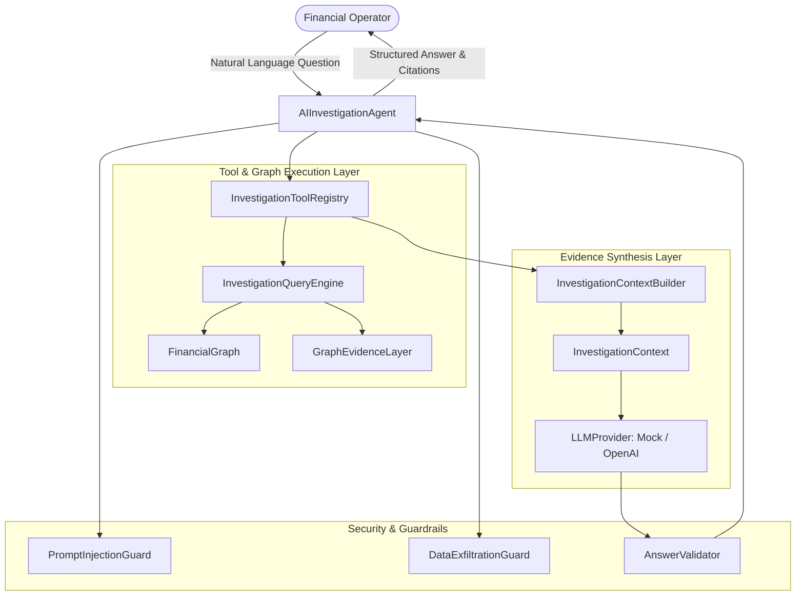

# ReconGraph — AI Investigation Agent

> **Authoritative Technical Documentation for Step 10: Evidence-Grounded AI Investigation Layer**  
> Package: `backend/app/investigation/`

---

## 1. Purpose

The ReconGraph AI Investigation Agent is an interpretation, natural-language explanation, and navigation layer built on top of the deterministic reconciliation engine, graph evidence, and causal graph index. It enables financial operations personnel to investigate complex reconciliation exceptions and multi-hop transaction lifecycles using conversational queries.

> **Foundational Axiom:**  
> *"RULES DETERMINE TRUTH. EVIDENCE EXPLAINS TRUTH. AI EXPLAINS THE EVIDENCE."*  
> The AI layer NEVER decides or computes financial truth; the deterministic reconciliation engine is the sole financial authority.

---

## 2. System Architecture



---

## 3. Read-Only Security Model

To protect financial data integrity and system security:
- **No Mutation:** All investigation tools are strictly read-only.
- **No Shell/Python Execution:** The AI cannot execute arbitrary code or shell commands.
- **No DB Mutation:** The AI cannot create, update, or delete financial records.
- **No Direct Filesystem Access:** File operations are restricted.
- **Isolated from Truth:** The agent has zero access to `GroundTruth` or `AnomalyManifest`.

---

## 4. Provider Abstraction & Offline Execution

The agent is completely provider-agnostic via [`LLMProvider`](file:///c:/Users/Mohammed%20Noufal%20V/recongraph/backend/app/investigation/providers.py#L14-L26):
1. **[`DeterministicMockProvider`](file:///c:/Users/Mohammed%20Noufal%20V/recongraph/backend/app/investigation/providers.py#L29-L110):** Default offline provider that deterministically synthesizes evidence-backed explanations from `InvestigationContext`. Enables 100% offline, reproducible CI/CD test execution without API keys.
2. **[`OpenAICompatibleProvider`](file:///c:/Users/Mohammed%20Noufal%20V/recongraph/backend/app/investigation/providers.py#L113-L162):** Optional live provider using standard library HTTP requests (`urllib.request`). Configurable via environment variables:
   - `RECONGRAPH_LLM_API_KEY`: API Key for LLM provider.
   - `RECONGRAPH_LLM_MODEL`: Model name (default: `gpt-4o`).
   - `RECONGRAPH_LLM_BASE_URL`: Base URL (default: `https://api.openai.com/v1`).

---

## 5. Read-Only Investigation Tools

The [`InvestigationToolRegistry`](file:///c:/Users/Mohammed%20Noufal%20V/recongraph/backend/app/investigation/tools.py#L17-L210) provides read-only tools:
- **`search_financial_entities(query)`**: Deterministic lookup across settlement IDs, payment IDs, order IDs, bank UTRs.
- **`get_settlement_investigation(settlement_id)`**: Retrieves settlement amounts, line items, constituent payment net sums, refund debits, adjustments, bank entry comparisons, and mathematical deltas.
- **`get_payment_investigation(payment_id)`**: Traverses order context, refunds, transfers, STXNs, and settlement status.
- **`get_order_investigation(order_id)`**: Retrieves order status and attempted payments.
- **`get_refund_investigation(refund_id)`**: Retrieves refund details and parent payment.
- **`get_adjustment_investigation(adjustment_id)`**: Retrieves adjustment details and STXN link.
- **`get_bank_entry_investigation(bank_entry_id)`**: Retrieves bank transaction details and UTR.
- **`get_exception_neighborhood(exception_id, settlement_id)`**: Extracts the causal subgraph around a reconciliation exception.
- **`get_graph_neighbors(node_id, direction)`**: Immediate adjacency traversal.
- **`get_graph_path(source_node_id, target_node_id)`**: Causal path between two nodes.
- **`get_reconciliation_evidence(node_id)`**: Retrieves rule codes, explanations, and observed vs expected values.

---

## 6. Context Builder & Evidence Grounding

The [`InvestigationContextBuilder`](file:///c:/Users/Mohammed%20Noufal%20V/recongraph/backend/app/investigation/context.py#L50-L98) extracts compact facts from tool results:
- Monetary amounts are preserved as exact `Decimal` strings (e.g. `"14396.00"`, `"-250.00"`). Floating-point conversions are strictly forbidden.
- Citations are extracted and mapped (e.g. `[E1] Settlement:setl_001`, `[E2] BankEntry:bank_001`, `[E3] Rule:BANK_AMOUNT_MISMATCH`).

---

## 7. Guardrails & Defenses

1. **[`PromptInjectionGuard`](file:///c:/Users/Mohammed%20Noufal%20V/recongraph/backend/app/investigation/guardrails.py#L24-L35):** Scans operator questions for prompt injection tokens (`ignore previous instructions`, `system prompt`, `admin override`).
2. **[`DataExfiltrationGuard`](file:///c:/Users/Mohammed%20Noufal%20V/recongraph/backend/app/investigation/guardrails.py#L38-L49):** Rejects attempts to access secrets, API keys, passwords, or internal configurations.
3. **[`AnswerValidator`](file:///c:/Users/Mohammed%20Noufal%20V/recongraph/backend/app/investigation/guardrails.py#L52-L85):** Verifies that all monetary figures and entity IDs mentioned in the generated answer exist in the retrieved `InvestigationContext`. Unverified hallucinations trigger a deterministic fallback response.

---

## 8. Ambiguity & Missing Evidence Handling

- **Ambiguity:** If a user submits a general query (e.g., *"Why is the settlement wrong?"*) and multiple candidate settlements exist in ObservedWorld, the agent returns `InvestigationStatus.NEEDS_CLARIFICATION` listing candidate IDs rather than guessing.
- **Missing Evidence:** If an entity is missing (e.g. `MISSING_BANK_ENTRY`), the agent states: *"The settlement has no corresponding bank entry in the observed dataset."* It never invents causal claims like *"The bank forgot to transfer the funds."*

---

## 9. Example End-to-End Investigation Flow

```
OPERATOR:
"Why is settlement setl_877572 short by ₹250?"

AI INVESTIGATOR:
1. Target Identified: settlement:setl_877572
2. Tool Executed: get_settlement_investigation(setl_877572)
3. Structured Context:
   - Settlement Amount: ₹14,396.00
   - Constituent Net Sum: ₹14,396.00
   - Bank Entry Amount: ₹14,146.00
   - Bank Delta: -₹250.00
   - Exception Rule: BANK_AMOUNT_MISMATCH
4. Synthesized Answer:

FINDING:
Settlement setl_877572 has a discrepancy with the observed bank statement.

EVIDENCE:
[E1] Settlement setl_877572
[E2] BankEntry bank_877572
[E3] BANK_AMOUNT_MISMATCH

FINANCIAL BREAKDOWN:
Settlement Amount: ₹14,396.00
Bank Entry Amount: ₹14,146.00
Difference: -₹250.00

AFFECTED RECORDS:
- Settlement setl_877572
- BankEntry bank_877572

RECOMMENDED NEXT CHECK:
Inspect the bank statement transaction corresponding to UTR MOCKUTR877572 to resolve the -₹250.00 delta.
```
