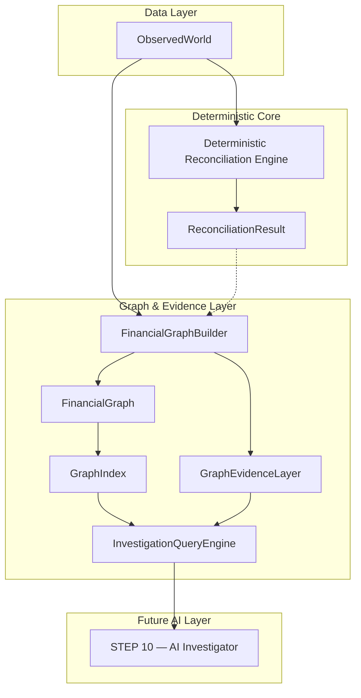
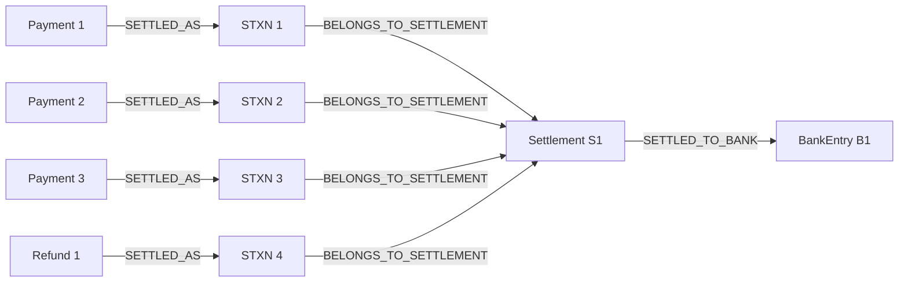

# ReconGraph — Financial Investigation Graph

> **Authoritative Technical Documentation for Step 9: Financial Relationship Graph & Investigation Layer**  
> Package: `backend/app/graph/`

---

## 1. Purpose

The ReconGraph Financial Investigation Graph provides a deterministic graph data structure and query engine over financial entities and reconciliation findings. Given any financial entity (settlement, payment, order, refund, adjustment, bank entry) or reconciliation exception, the graph allows deterministic traversal of its complete causal neighborhood and retrieves authoritative mathematical evidence.

---

## 2. Architecture & System Context

The investigation graph layer sits directly between deterministic reconciliation and future AI investigation modules:

---

## 3. Node Model

All graph nodes are represented by the immutable [`GraphNode`](file:///c:/Users/Mohammed%20Noufal%20V/recongraph/backend/app/graph/models.py#L12-L26) model:

- **`node_id`**: Deterministic format `<entity_type>:<entity_id>`. (e.g. `merchant:merch_001`, `order:ord_001`, `payment:pay_001`, `refund:ref_001`, `adjustment:adj_001`, `transfer:trf_001`, `settlement_transaction:stxn_001`, `settlement:setl_001`, `bank_entry:bank_001`).
- **`entity_type`**: Entity domain type string.
- **`entity_id`**: Underlying entity primary key.
- **`display_label`**: Human-readable label with formatted currency/amount.
- **`attributes`**: Immutable dictionary of entity metadata (amounts, status, timestamps, fees, taxes).

---

## 4. Edge Model & Relationship Types

Edges are represented by the immutable [`GraphEdge`](file:///c:/Users/Mohammed%20Noufal%20V/recongraph/backend/app/graph/models.py#L29-L43) model:

- **`edge_id`**: Deterministic format `edge:<source_node_id>-><target_node_id>:<rel_type>`.
- **`directed`**: True.
- **`attributes`**: Optional edge metadata.

### Domain Relationship Types:
| Source Entity | Target Entity | Relationship Type | Description |
|---|---|---|---|
| `merchant` | `order` | `OWNS_ORDER` | Merchant created the order |
| `order` | `payment` | `HAS_PAYMENT` | Payment attempted on the order |
| `payment` | `refund` | `HAS_REFUND` | Refund issued against payment |
| `payment` | `transfer` | `HAS_TRANSFER` | Marketplace fund split |
| `payment` | `settlement_transaction` | `SETTLED_AS` | Payment participation in settlement |
| `refund` | `settlement_transaction` | `SETTLED_AS` | Refund debit in settlement |
| `adjustment` | `settlement_transaction` | `SETTLED_AS` | Dispute / fee adjustment in settlement |
| `transfer` | `settlement_transaction` | `SETTLED_AS` | Transfer participation in settlement |
| `settlement_transaction` | `settlement` | `BELONGS_TO_SETTLEMENT` | STXN rolled into batch settlement |
| `settlement` | `bank_entry` | `SETTLED_TO_BANK` | Bank credit entry matching settlement UTR |
| `adjustment` | `settlement` | `AFFECTS_SETTLEMENT` | Direct adjustment reference to settlement |

---

## 5. Many-to-One Settlement Representation

In real-world payment processing, multiple payments and deductions roll into a single batch settlement payout. The graph preserves each constituent payment and line item as distinct nodes converging into the settlement:

---

## 6. Refund and Adjustment Representation

- **Refunds:** Each refund remains a distinct node linked from its parent payment via `HAS_REFUND` and linked to its settlement transaction via `SETTLED_AS`.
- **Adjustments:** Each dispute or adjustment is represented as an independent event node linked to its corresponding debit/credit STXN and settlement. Adjustments are never merged into payments or labeled as artificial "balancers".

---

## 7. Reconciliation Evidence Layer

The [`GraphEvidenceLayer`](file:///c:/Users/Mohammed%20Noufal%20V/recongraph/backend/app/graph/evidence.py) binds deterministic reconciliation findings directly to graph nodes:
- Attaches `GraphEvidence` records containing exact rule codes, severity, expected values, observed values, differences, and related node IDs.
- Tracks reconciliation status (`RECONCILED`, `EXCEPTION`, `UNMATCHED`) per node.

---

## 8. Traversal & Investigation Queries

The [`InvestigationQueryEngine`](file:///c:/Users/Mohammed%20Noufal%20V/recongraph/backend/app/graph/queries.py) exposes deterministic queries:

1. **`get_settlement_investigation(settlement_id)`**:
   - Traverses all constituent transactions, payments, refunds, adjustments, orders, and bank entries.
   - Computes exact mathematical breakdowns:
     $$\text{Calculated Component Total} = \sum \text{Payments (Net)} + \sum \text{Refunds (Net)} + \sum \text{Adjustments (Net)}$$
     $$\text{Composition Delta} = \text{Calculated Total} - \text{Settlement Amount}$$
     $$\text{Bank Delta} = \text{Bank Entry Amount} - \text{Settlement Amount}$$
2. **`get_payment_investigation(payment_id)`**:
   - Returns parent order, child refunds, settlement transaction, settlement, and bank entry context.
3. **`get_exception_neighborhood(exception)`**:
   - Retrieves the primary entity node, connected causal subgraph, and attached reconciliation evidence.

---

## 9. Determinism, Immutability & Isolation Guarantees

1. **Deterministic Ordering:** All nodes, edges, neighbor lists, and traversal paths are sorted deterministically by type and ID.
2. **Immutability:** Domain entities in `ObservedWorld` and graph models are frozen Pydantic models.
3. **Import Isolation:** The graph package operates strictly on `ObservedWorld` and optional `ReconciliationResult`. It contains zero imports or references to `GroundTruth`, `AnomalyManifest`, `ScenarioLabel`, or `random`.
4. **No AI in Step 9:** Graph construction is 100% deterministic and rule-based. Step 10 will consume this graph layer as structured context for LLM explanation generation.
